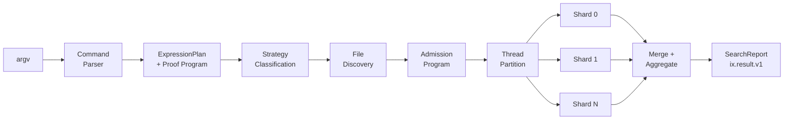
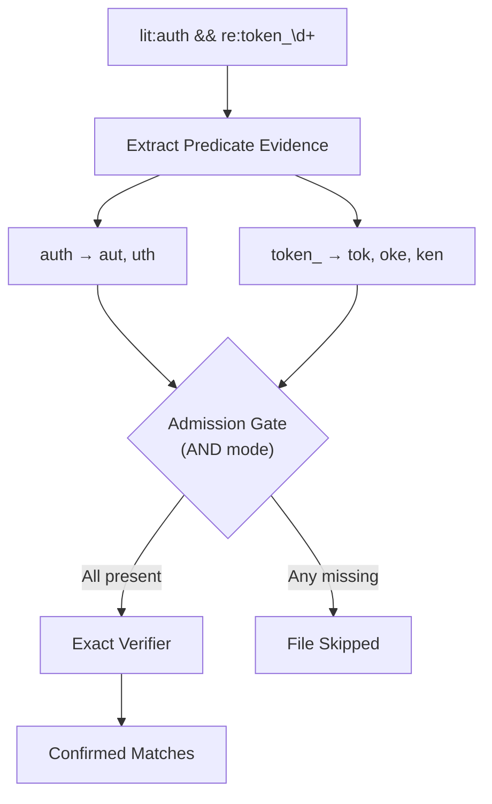

<div align="center">

# IX

**32 bytes/cycle code search. Strategy-classified regex dispatch. PCRE2 JIT compiled regex. Trigram-gated file rejection. Admission-bytecode lane. Thread-sharded execution. Exact-verified output.**

*AVX2 SIMD literal scan · Boolean predicate algebra · Arena-allocated pipeline · Vendored C kernels compiled into one binary*

---

[](https://ziglang.org/)
[](#what-is-inside)
[](#what-is-inside)
[](#what-is-inside)
[](#what-is-inside)
[](#execution-model)
[](LICENSE)

[Origin](#origin) · [What It Is](#what-it-is) · [Use It](#use-it) · [How It Works](#how-it-works) · [What Is Inside](#what-is-inside) · [Trigram Acceleration](#exact-trigram-acceleration) · [Admission Bytecode](#admission-bytecode-lane) · [Roadmap](#roadmap)

</div>

---

## Origin

IX started as a port of an existing Rust search engine. The initial goal was straightforward — rewrite the Rust codebase in Zig, preserve the CLI contract, ship a compatible binary.

That lasted about a week.

Zig's compile-time execution, explicit control over memory layout, and direct access to SIMD intrinsics through `@Vector` made it clear that a line-by-line port would waste the language. The chunked I/O path was rebuilt around 1 MiB cache-line-aligned buffers instead of Rust's mmap abstraction. The regex dispatch was rebuilt as a compile-time strategy classifier that routes queries to the narrowest execution path before a single byte is read. The casefold pipeline was rebuilt as a custom `@Vector(32, u8)` operation that processes 32 bytes per iteration at the chunk level — not per-line. The thread model was rebuilt with thread-local shard accumulation and zero mutex contention on the hot path.

What ships today is not a port. It is a search engine rebuilt from the ground up in Zig, shaped by what the language makes possible and what the hardware actually wants to do. The CLI contract and JSON output schema remain compatible — the engine underneath is its own.

---

## What It Is

IX is a search engine built around one constraint: the fastest path to an exact result. Queries written in the IX expression language — `lit:`, `re:`, `prefix:`, `suffix:`, boolean `&&` / `||` — are each classified into the narrowest execution strategy before touching a byte of input.

Literal queries land on the SIMD byte-search path — 32 bytes per cycle through 256-bit vector lanes. Regex patterns with extractable literals bypass the regex engine and hit the SIMD path directly. Full regex patterns compile through PCRE2 10.44 with JIT — the pattern is compiled to native machine code once per thread and reused for every line. AND/OR queries extract mandatory trigram evidence and reject ineligible files before a single line is scanned. File scans shard across threads with thread-local accumulation — zero mutex contention on the hot path.

The first executable admission slice now compiles trigram evidence once per query into a compact rolling membership program and threads that immutable program through the serial, mmap, and worker scan paths. The larger retained architecture lane is still `PathAdmission -> FileAdmissionBytecode -> ByteKernel -> LineVerifier`: reject work before line splitting and before PCRE2, using path predicates, file metadata, PCRE2-proven byte facts, and one-pass trigram evidence.

> [!NOTE]
> Acceleration rejects candidates. It never creates matches.
> The exact verifier confirms every emitted result.

The binary is 2 MB. It vendors everything — StringZilla, PCRE2 with JIT — compiled from source into a single static binary. No package manager. No network fetch. No runtime dependencies. `zig build` and it ships.

---

## Use It

```sh
git clone https://github.com/AX-IX/ix-zig.git
cd ix-zig
zig build test --summary all
zig build -Doptimize=ReleaseFast --summary all
```

> [!NOTE]
> All dependencies are vendored — no network fetches, no package manager. StringZilla lives at `.refs/stringzilla/`, PCRE2 10.44 at `.refs/pcre2/`. The build compiles PCRE2 from source with JIT enabled (`SUPPORT_JIT=1`) via a static `config.h`. Requires Zig 0.16.0+ and a C toolchain (provided by Zig's bundled `zig cc`).

```sh
ix search 'lit:fn' src --json
ix search 're:TODO|FIXME' .
ix search 'lit:TODO || lit:FIXME' .
ix matches 're:TODO|FIXME' .
ix inspect src/main.zig --range 40:80
ix inspect --expr 'lit:SearchConfig' src --context 2 --json
ix explain 'lit:auth && re:token_\d+'
```

| Command | Behavior |
|:--------|:---------|
| `search` | Hit records + terminal `ix.result.v1` result state |
| `matches` | Hit records only — same engine, no sentinel |
| `inspect` | Read-only file windows and match context |
| `explain` | Expression plan JSON with strategy annotation |

<details>
<summary><strong>Expression syntax</strong></summary>
<br>

```text
lit:text           literal substring
re:pattern         regex (required prefix)
prefix:text        line-start match
suffix:text        line-end match
A && B             boolean AND
A || B             boolean OR
```

Bare text is literal. `re:` is required for regex. `||` composes alternates.

</details>

<details>
<summary><strong>Compat translator</strong></summary>
<br>

Bare `ix PATTERN [PATH]` accepts a narrow `rg`-shaped subset and lowers it into canonical IX expressions. Supports `-e` (multiple patterns → `||`), `-F` (fixed strings → escaped `lit:` or `re:`), `-i` (case insensitive → `(?i)` prefix), `-j N` (threads). Raw regex containing `&&` or `||` is ambiguous and rejected at parse time.

This is a translator, not a second grammar.

</details>

---

## How It Works



### Strategy Routing

Each query is classified by shape and routed to the narrowest execution path:

| Query Shape | Route | Notes |
|:------------|:------|:------|
| `lit:needle` | StringZilla AVX2 `memmem` with first/last-byte fingerprint | 32 bytes/cycle · ~1 byte/cycle for edge cases |
| `prefix:x` / `suffix:x` | byte equality verifier | no SIMD · scoped to boundary bytes |
| `re:literal` | regex-classified literal path | literal extracted, SIMD prefilter, verifier confirms |
| `re:(?i)literal` | ASCII casefold literal path | case normalization + literal search |
| `re:\bliteral\b` | literal search + boundary verifier | SIMD literal, then `\b` predicate on matches |
| `re:TODO\|FIXME` | literal-alternates strategy | multiple patterns per line |
| `re:process_\d+` | literal-prefix prefilter + PCRE2 JIT verifier | `process_` searched first, then `\d+` verified by PCRE2 |
| `re:\w+\s+\w+` | PCRE2 JIT full regex | compiled to native machine code · threadlocal cache · backtracking fallback |
| `lit:a && lit:b` | AND plan with trigram admission | both literals required · trigram gate rejects files missing either |

### Execution Model

| Phase | Behavior |
|:------|:---------|
| Root pruning | Deduplicate, contained-by eviction, reverse containment (swap-remove O(1)) |
| File discovery | Custom recursive walker — serial `readdir` traversal, hidden-file filtering, zero gitignore parsing overhead |
| Admission program | Current first slice: compiled `TrigramAdmissionProgram` over query evidence; planned full pipeline adds path class, file metadata, binary prefix, and PCRE2 byte facts |
| Trigram admission | Exact negative gate: reject files ineligible by mandatory-byte evidence using one rolling pass over each candidate buffer |
| File-scan sharding | Distribute files across N threads, each with thread-local `ShardReport` |
| Shard accumulation | Thread-local counters + hit buffers — zero mutex contention |
| Merge | Combine shard reports after all threads join |
| Result-state | Compute `ix.result.v1` digest from merged stats |

### Output Protocol

`search` emits a terminal `ix.result.v1` JSON sentinel. `inspect` emits `ix.inspect.*` sentinels with `ix.next.v1` continuation hints for pagination. Zero-match search returns `status:"ok"` with `matches:0`, not an error. All output is structured for machine consumption.

---

## What Is Inside

| Layer | Implementation |
|:------|:---------------|
| Byte search | StringZilla v4.6.0, AVX2: `VPCMPEQB` (32 bytes per 256-bit YMM lane) + `VPMOVMSKB` (compress mask) + `TZCNT` (position). Substring search fingerprints by first+last byte across 32 candidate positions; full byte-by-byte verify only on survivors. Most false positives eliminated without touching the needle interior. |
| SIMD backend | Compile-time selection only — `-mavx2` → `__AVX2__` → `SZ_USE_HASWELL=1`. `SZ_DYNAMIC_DISPATCH=0` disables runtime CPU detection (and DllMain on Windows). SWAR fallback (~8 bytes/cycle) if built without `-mavx2`. Zero dispatch overhead in the final binary. |
| Zig/C boundary | `sz_shim.c` — StringZilla is header-only (`static inline`); Zig's `@cImport` can't link those, so the shim forces the C compiler to emit real linkable symbols. Include chain `immintrin.h → mm_malloc.h → stdlib.h` requires `link_libc = true` in `build.zig`. |
| PCRE2 integration | Vendored PCRE2 10.44 source at `.refs/pcre2/` compiled via `addCSourceFiles` in `build.zig` (27 translation units). Static `config.h` enables `SUPPORT_JIT`, `SUPPORT_UNICODE`, and `PCRE2_STATIC`. The sljit backend at `.refs/pcre2/src/sljit/` compiles regex patterns to native x86 machine code. `pcre_regex.zig` wraps the C API via `@cImport` with a threadlocal single-entry compile cache — zero overhead on cache hit, one JIT compilation per unique pattern per thread. |
| Query model | Typed `ExpressionPlan`, boolean composition, explicit literal / regex / prefix / suffix predicates with trigram evidence extraction |
| Admission bytecode | First executable slice lives in `search.zig` as `TrigramAdmissionProgram`: open-addressed trigram membership, per-group counters, `AND`/`OR` satisfaction masks, and no heap allocation during execution. Planned full `FileAdmissionProgram`: `RejectByPathClass`, `RejectByExtSet`, `RejectBinaryPrefix`, `RequireAnyFirstByteSet`, `RequireLastCodeUnit`, `RequireMinLength`, `RequireTrigramGroups`. |
| Regex engine | PCRE2 10.44 with JIT compilation — patterns are compiled to native x86 machine code via sljit, cached per-thread, and reused for every line. A threadlocal single-entry cache gives compile-once semantics without changing function signatures. If PCRE2 cannot compile a pattern (e.g. unsupported syntax), the caller falls back to the Zig-native recursive backtracking verifier transparently via `pcre_regex.column(...) catch regex.column(...)`. |
| Regex fallback | Zig-native recursive backtracking — serves as the safety net for patterns PCRE2 rejects. Supports grouped alternation with group-end-to-suffix handoff (`(session\|handshake)\b` works because the `\b` check fires at the exact byte after the branch ends). |
| Strategy classification | `MatcherStrategy` — literal (direct SIMD), casefold-literal (ASCII normalization), word-boundary (literal + boundary verifier), literal-alternates (multi-pattern), prefix-prefilter (partial scan + PCRE2 JIT verify), full-regex (PCRE2 JIT) |
| File scan | Two-phase: serial file discovery (readdir), then parallel partition across worker threads with thread-local `ShardReport` (no mutex in hot path) |
| Trigram gate | Exact-byte mandatory-trigram rejection; predicate evidence admission — conjunctions (AND) require all evidence groups, disjunctions (OR) fail if any branch is unindexed; candidate files execute a single rolling trigram stream over compiled query membership |
| Word-boundary byte shard | Stats-only `re:\bLITERAL\b` plans lower to `ByteShardPlan.strategy = word_boundary_literal` for large mmap-backed files. Each shard owns complete newline-aligned logical lines, scans candidates with `simd.indexOf`, verifies exact `\b` boundaries, counts at most one match per owned line, and falls back before risking double counts on long unbounded lines. |
| Nexus evidence frontier | Public `search` / `matches` launch a hidden `__ix_nexus` sidecar after the foreground report is computed. The sidecar is stats-only, stdout/stderr-silent, no-window on Windows, and writes `.ix-evidence-{key}.cache` only from the background path. Foreground searches never synchronously build the artifact; they consume a validated expression/root/path-set frontier if it already exists and skip redundant sidecar rebuilds after a successful evidence-pruned reuse. |
| Byte kernels | Current hot kernels are Zig `@Vector(32, u8)` and StringZilla AVX2. Planned narrow C shim additions are limited to primitives Zig cannot emit cleanly: `ix_count_byte_avx2`, `ix_ascii_ci_memmem_avx2`, and `ix_trigram_admit_scalar_or_avx2`. |
| Inspect | Bounded read-only windows, match-context mode, `ix.inspect.*` sentinels, `ix.next.v1` continuation hints for agent pagination |
| Explain | Structured plan JSON, strategy annotation, proof-program lowering — queries classified as `conjunctive_literal_evidence`, `conjunctive_regex_with_mandatory_evidence`, `disjunctive_byte_evidence`, or `verifier_only` with trigram terms and verifier type |
| Stats schema | Telemetry model with full timing breakdown — `discover_ms`, `scan_ms`, `aggregate_ms`, `scan_work_ms_total` across all shards. Per-file slowest-path profiling. Trigram acceleration stats: candidate files checked, pruned, verified, ineligible. Byte-shard telemetry reports strategy, profiled files, range calls, line-aligned ranges, boundary candidates verified/rejected, logical bytes, elapsed range time, and matches owned by the byte kernel. |
| Memory model | Arena allocator from process init — all allocations live for process lifetime, zero individual frees. Short-lived CLI process; arena released on exit. No deallocation overhead in the hot path. |

### Scan-Path Optimizations

- **Whole-buffer fast count** — single-chunk files (< 1 MiB) with single-predicate stats-only queries skip line splitting entirely. Match count is computed over the raw buffer in one pass, eliminating newline scanning and per-line dispatch.
- **Word-boundary byte-sharded fast count** — stats-only `re:\bLITERAL\b` on large mmap-backed files bypasses materialized line splitting. The planner emits a `word_boundary_literal` byte-shard descriptor; shards claim newline-owned byte ranges, verify boundary predicates around each candidate literal hit, and count one logical-line match per owned line. Unsupported or unsafe ranges fall back to the materialized verifier.
- **Chunk casefold** — case-insensitive queries with all-lowercase literal predicates casefold the 1 MiB read buffer in-place once per chunk instead of per-line. Reduces ~100k `toLower` calls to ~500 AVX2 vector passes on a 500-file corpus.
- **SIMD ASCII casefold** — custom `@Vector(32, u8)` pipeline: wrapping-subtract `'A'` (maps A-Z to 0-25), compare `< 26` to mask uppercase, select-OR `0x20`. 32 bytes per iteration, scalar tail for remainder.
- **Adaptive thread scaling** — thread count is `ceil(sqrt(file_count / 8))`, capped at CPU count. Avoids Windows `CreateThread` spawn cost (~210μs) dominating scan work on small corpora.
- **Dynamic work claiming** — for corpora < 128 files with eligible plans, workers claim files via `@atomicRmw(.Add)` instead of static partitioning. Eliminates tail imbalance when file sizes vary.
- **`__chkstk` avoidance** — casefold buffers (2 KiB line + 256 B needle) are isolated into separate functions. Keeps hot-path stack frames under 4 KiB, avoiding Windows page-probe overhead on every function entry across 100k+ lines.
- **Single-shot positional read** — first chunk uses `readPositional` (one syscall) instead of `readPositionalAll` (retry loop). Most source files are < 1 MiB and fit in a single read. File length lookup deferred until the first chunk proves the file exceeds the buffer.
- **1 MiB chunk sizing** — chosen to fit in L2/L3 cache so StringZilla SIMD newline scan operates on warm cache lines. Larger buffers risk cache thrashing; smaller ones increase syscall frequency.
- **Binary sniff** — first 1024 bytes checked for null byte via `sz.indexOfByte`. Binary files skipped before any line processing.

### Design Properties

- The CLI surface is stable. The engine routes dynamically by query shape.
- Most regex queries are reduced to literal evidence before the verifier runs. The verifier only confirms.
- Trigram admission gates use boolean predicate algebra to reject files before scan.
- `inspect` is agent-native: bounded, read-only, structured, continuable via `ix.next.v1`.
- Thread-local shard reports eliminate mutex contention. Each thread accumulates its own counters and hit buffers; results merge after join.

---

## Exact Trigram Acceleration

The trigram path is a safe negative gate. It rejects files that cannot contain mandatory byte evidence. It never emits matches.



Predicate evidence admission (boolean algebra):

```text
AND queries (lit:a && lit:b):
  -> all predicate evidence groups must be found
  -> if any predicate has zero trigrams, admission fails
  -> candidate files: intersection of all trigram postings

OR queries (lit:a || lit:b):
  -> any unindexed predicate (no trigrams) → entire query ineligible
  -> if all predicates indexed: union of trigram postings

Mixed (lit:a && (lit:b || lit:c)):
  -> if (lit:b || lit:c) has unindexed branch → ineligible
  -> otherwise: AND of a's trigrams with union of b,c trigrams
```

Today the trigram gate operates per-scan: evidence is extracted at query parse time, compiled once into `TrigramAdmissionProgram`, then checked against each candidate file's raw bytes inline. The retained implementation performs one streaming rolling-trigram pass over each candidate buffer instead of repeated substring probes per required trigram.

```text
rolling = (b[i-2] << 16) | (b[i-1] << 8) | b[i]
if rolling in query_set:
  mark term/group seen

AND admission:
  all evidence groups satisfied

OR admission:
  any indexed branch group satisfied
```

The `explain` command surfaces the proof program — mandatory trigrams, admission mode, and evidence groups — via `corpus.zig`. The first hot-path executable form now uses the same evidence contract for trigram rejection; the next lane extends that contract into full file-admission bytecode.

> [!TIP]
> **Planned**: persistent `CorpusIndex` with durable trigram postings, mmap-backed epoch checkpoints, and adaptive posting-list representations (dense bitset / Roaring / sorted `u32` / inline singleton by evidence density). See [Roadmap](#roadmap).

---

## Admission Bytecode Lane

This lane was selected after the 2026-05-11 Rust IX comparison on the Linux bench corpus:

```text
Zig total: 681.5082 ms
Rust IX total: 620.3549 ms
gap: 9.86%
discovery: 174.7226 ms
scan: 506.5152 ms
files discovered: 79088
```

The measured gap is dominated by discovery plus scan admission, not by final result aggregation. The pipeline target is:

```text
SearchRequest + ExpressionPlan
  └─ compile FileAdmissionProgram
      ├─ PathAdmission
      │   ├─ hidden/generated/vendor policy
      │   └─ extension/type predicates
      ├─ MetadataAdmission
      │   ├─ minimum length
      │   └─ binary prefix sniff
      ├─ RegexMetadataAdmission
      │   ├─ PCRE2_INFO_FIRSTBITMAP
      │   ├─ PCRE2_INFO_FIRSTCODETYPE / FIRSTCODEUNIT
      │   ├─ PCRE2_INFO_LASTCODETYPE / LASTCODEUNIT
      │   ├─ PCRE2_INFO_MINLENGTH
      │   └─ PCRE2_INFO_JITSIZE
      ├─ TrigramAdmission
      │   └─ one-pass rolling evidence kernel
      └─ LineVerifier
          ├─ literal / prefix / suffix verifier
          ├─ PCRE2 JIT verifier
          └─ Zig fallback verifier
```

Implemented first slice:

```text
TrigramAdmissionProgram
  ├─ compile once from trigram.Admission
  ├─ open-addressed 4096-slot trigram membership table
  ├─ group_masks[slot] marks every evidence group containing that trigram
  ├─ one rolling 24-bit key per input byte after byte 2
  ├─ seen_slots prevents duplicate file occurrences from double-counting
  ├─ group_seen_counts tracks per-predicate evidence satisfaction
  └─ satisfied_group_mask decides AND/OR admission early
```

For single-predicate literal / prefix / suffix / regex-word-boundary plans, a contract-safe whole-file mandatory needle admission runs before trigram admission. That fast path rejects files with one SIMD substring probe when the exact predicate shape proves the byte sequence is mandatory; trigram admission remains the multi-evidence boolean gate.

2026-05-11 post-slice measurement on the same Linux corpus profile, 9 measured samples / 2 warmups:

```text
Zig total: 652.9729 ms
Rust IX total: 631.6790 ms
gap: 3.37%
discovery: 182.8081 ms
scan: 469.9454 ms
files discovered: 79088
```

Cold-lane word-boundary byte-shard verifier erasure:

```text
Target:
  expression: re:\bPM_RESUME\b
  corpus: E:\Workspaces\01_Projects\01_Github\iEx\.refs\ripgrep\benchsuite\linux
  mode: IX_NEXUS=0, --json --stats-only --threads 32

Planner:
  strategy: regex_word_boundary_literal -> ByteShardPlan.word_boundary_literal
  range ownership: newline-aligned logical lines
  candidate scan: simd.indexOf over mmap-backed byte ranges
  verifier: wordBoundaryLiteralAt on candidate boundaries
  fallback: materialized path when line ownership cannot be proven

2026-05-11 7-sample gate:
  previous reference median wall: 637.615 ms
  current median wall: 609.966 ms
  delta: -27.649 ms (-4.34%)
  matches: 9
  files scanned: 79085
  bytes scanned: 1340745076
  execution_mode: byte_sharded
  byte_shard_kernel.strategy: word_boundary_literal
  byte_shard_kernel.files_profiled: 10
  byte_shard_kernel.range_calls: 40
  byte_shard_kernel.line_aligned_ranges: 40

Guard lanes:
  lit:Sherlock Holmes, en.sample.txt, --threads 8:
    previous reference median wall: 38.043 ms
    current median wall: 34.788 ms
    delta: -8.56%
  lit:the, Linux corpus, --threads 32:
    current median wall: 613.823 ms
    matches: 1469971
```

Interpretation: this removes the materialized verifier lane for large negative word-boundary files and proves the byte-shard control plane for `\bLITERAL\b`. It is a retained cold-lane improvement, not a 10x class jump. The remaining PM_RESUME cost is dominated by discovery/open/admission and nested shard scheduling because the matching files are small while the byte-sharded files are mostly large negatives.

Nexus evidence-frontier sidecar:

```text
Foreground cold search:
  command: ix-zig search "re:\bPM_RESUME\b" <linux bench corpus> --json --stats-only
  foreground cache writes: 0
  sidecar: __ix_nexus <expression> <root> --json --stats-only
  Windows launch: CreateProcessW, DETACHED_PROCESS, CREATE_NEW_PROCESS_GROUP, CREATE_NO_WINDOW
  artifact: .ix-evidence-e98d5d68a37c0b3.cache
  artifact magic: IXEVIDENCE2
  write-side content epoch: hash(path, size, inode/file-index, mtime) over the discovered set
  foreground content stat walk: 0

2026-05-11 regression gate, 9 samples:
  current foreground cold + sidecar spawn:
    average wall: 677.1841 ms
    median wall: 680.6401 ms
    average total: 666.0318 ms
    median total: 671.4816 ms
    median scan: 506.6930 ms
    pruned from evidence: 0

  current evidence-hot:
    average wall: 165.0266 ms
    median wall: 164.1002 ms
    average total: 158.3406 ms
    median total: 157.1446 ms
    median scan: 7.0478 ms
    pruned from evidence: 79041 files

  committed baseline before this slice (51f8b3b):
    cold average wall: 672.0882 ms
    cold median wall: 666.4609 ms
    hot average wall: 203.0736 ms
    hot median wall: 203.6417 ms
    hot median scan: 8.1764 ms

  Rust IX direct:
    average wall: 649.4291 ms
    median wall: 653.0254 ms
    median total: 632.7093 ms
```

The evidence frontier is the first invisible sidecar slice, not the final persistent corpus index. It validates the discovered path set and a write-side content epoch before foreground reuse, so stale retained frontiers fail closed instead of producing false negatives after content edits. The current freshness owner uses portable file metadata (`path`, size, inode/file-index, and mtime); the planned NTFS USN journal invalidator remains the next Windows-specific step because it can prove the same epoch boundary without charging a full foreground metadata walk on very large trees.

Planned full opcode surface:

```text
RejectByPathClass
RejectByExtSet
RejectBinaryPrefix
RequireAnyFirstByteSet
RequireLastCodeUnit
RequireMinLength
RequireTrigramGroups
```

Design constraints:

- Admission bytecode is pure data compiled once per query.
- Execution performs no heap allocation.
- Every opcode is a negative gate only; the exact verifier still owns match creation.
- PCRE2 metadata can only be lowered when PCRE2 proves the fact. Heuristic mandatory-literal inference is not allowed to reject files.
- C is admitted only as a kernel layer under stable Zig-owned opcodes.

---

## Correctness

Every emitted result is exact-verified. Acceleration structures (trigram gates, literal prefilters, strategy classification) only reject — they never create matches. The verifier confirms every hit.

| Invariant | Coverage |
|:----------|:---------|
| Match count parity | Literal, regex, case-insensitive, word-boundary, alternates, boolean AND/OR |
| Byte accounting | `bytes_scanned` exact across all query morphologies |
| File set | Identical file discovery and processing |
| Result envelope | `ix.result.v1` digest consistency |
| Phase timing | `discover_ms`, `scan_ms`, `aggregate_ms` tracked per-run |

---

## Source Layout

```text
src/
  main.zig          CLI entry and command dispatch
  sz_shim.c         StringZilla C shim
  cli/
    args.zig        argv parsing and compatibility lowering
    output.zig      text, JSON, sentinels, help
  core/
    expr.zig        IX expression grammar and strategy classification
    pcre_regex.zig  PCRE2 JIT regex engine (compile-once, match-many)
    regex.zig       Zig-native backtracking regex (fallback)
    search.zig      scan pipeline — discover, admission, shard, scan, merge, aggregate
    simd.zig        Zig @Vector byte-search kernels
    inspect.zig     bounded file windows and match context
    trigram.zig     trigram extraction and admission gates
    stats.zig       telemetry model
    sz.zig          StringZilla Zig wrapper
    corpus.zig      proof-program compilation for explain
```

---

## Roadmap

<details>
<summary><strong>Execution Core</strong> — scan path, hot loop, strategy dispatch</summary>
<br>

- **Executable admission bytecode** — promote the remaining `corpus.zig` proof-program lowering into the hot path as full `FileAdmissionProgram`. Compile once from `ExpressionPlan`, `SearchRequest`, and PCRE2 metadata; execute as allocation-free opcodes before line splitting. Initial opcode set: `RejectByPathClass`, `RejectByExtSet`, `RejectBinaryPrefix`, `RequireAnyFirstByteSet`, `RequireLastCodeUnit`, `RequireMinLength`, `RequireTrigramGroups`. The first `RequireTrigramGroups`-class executable slice is now live as `TrigramAdmissionProgram`; the remaining work is path, metadata, and PCRE2 fact lowering.
- **One-pass rolling trigram admission** — implemented: repeated `bytesContainTrigram` scans were replaced with a single streaming proof pass over each candidate buffer. The program maintains compact query membership and per-group satisfaction counters; `AND`/`OR` admission is decided from group state, collapsing `mandatory_trigram_count × file_bytes` behavior into `file_bytes + evidence_hits`.
- **PCRE2 metadata lowering** — query `PCRE2_INFO_FIRSTBITMAP`, first code unit, last required code unit, minimum length, and JIT size after pattern compilation. Lower only PCRE2-proven facts into admission bytecode; never infer mandatory regex literals heuristically where alternation or optional branches can create false negatives.
- **Narrow C byte-kernel shim** — add C only beneath stable Zig-owned opcodes when benchmarks prove a primitive is the ceiling. Candidate functions: `ix_count_byte_avx2`, `ix_ascii_ci_memmem_avx2`, and `ix_trigram_admit_scalar_or_avx2`. The Zig control plane, query planner, and verifier ownership remain canonical.
- **Aho-Corasick automaton for literal alternates** — single-pass multi-pattern matching via failure-link automaton. Current `literalAlternatesColumn` scans each alternate independently (N passes over the line). Automaton-based: one pass, O(line_length) regardless of pattern count. State transitions flattened to 256-wide arrays per state for cache-line-aligned lookup.
- **Multi-chunk whole-buffer fast count** — extend `wholeBufferFastCount` beyond the single-chunk (<1 MiB) gate. Accumulate literal occurrence counts across chunk boundaries via overlap region verification: last `needle.len - 1` bytes of chunk N concatenated with first `needle.len - 1` bytes of chunk N+1, Rabin-Karp rolling hash detects boundary-spanning candidates, full verify on collision. Eliminates line splitting for stats-only queries on files of any size.
- **Word-boundary byte-shard C kernel** — after the Zig-owned `ByteShardPlan.word_boundary_literal` lane proved correctness and positive median movement, the admissible C boundary is now only the inner candidate counter: `ix_count_word_boundary_literal_lines_avx2(data, len, needle, needle_len, ranges, out_counts)`. The Zig planner, newline-owned range proof, fallback gate, and tests remain canonical; C may replace candidate scan and ASCII boundary classification only after PMU/timing proves that loop is the ceiling.
- **Boyer-Moore-Horspool shift table for case-insensitive search** — replace the full-line `asciiLowerBuf` + `sz.indexOf` pipeline. Precompute bad-character shift table over both cases of each byte. Anchor search at the rarest byte in the needle via `memchr2` (upper + lower variant), then verify from anchor position using the shift table. Skips the 2 KiB stack casefold copy entirely.
- **`comptime` strategy specialization** — monomorphize `scanOpenFileIntoShard` per `MatcherStrategy` variant at compile time. Each variant gets a dedicated function body with the strategy-specific dispatch inlined. Function pointer selected once at parse time, called for every file. Eliminates the `switch (predicate.strategy)` branch in the inner loop — the branch predictor never sees it.
- **LTO across Zig/C boundary** — enable link-time optimization (`.want_lto = true` on C source steps in `build.zig`) so the compiler can inline StringZilla's `sz_find` / `sz_find_byte` directly into the Zig scan loop. Currently, the C shim creates an opaque call boundary that prevents the compiler from scheduling SIMD instructions across the Zig/C seam. With LTO, the `VPCMPEQB` → `VPMOVMSKB` → `TZCNT` sequence becomes part of the Zig function's instruction stream.
- **Loser tree (tournament) merge for shard results** — replace sequential shard merge with a K-way tournament tree. Internal nodes stored in struct-of-arrays layout: separate `loser_keys[]` and `loser_ids[]` arrays, each 64-byte cache-line aligned. Winner selection via branchless conditional move (`CMOV`): `key_wins = (a_key < b_key) | (a_key == b_key & a_id < b_id)` — zero branch predictor state consumed per comparison. Sentinel keys (`maxInt`) guarantee empty shards lose without explicit emptiness checks. For K=16 shards, the tournament is 32 nodes = 512 bytes = 8 cache lines — entire merge state resident in L1d. O(log K) per pop, O(K) initialization. Reference: TigerBeetle's `k_way_merge.zig`.
- **CLMUL structural boundary detection** — apply carryless multiplication (`VPCLMULQDQ`) to detect paired delimiters (quotes, brackets, comment markers) in 64 bytes per cycle. Extract delimiter positions via `VPCMPEQB`, eliminate escaped instances with predecessor-byte masking, then CLMUL the result to propagate parity: bit N is set iff an odd number of unescaped delimiters precede position N. One instruction replaces a byte-by-byte state machine. A cumulative XOR carries the "inside string" state across chunk boundaries without branching. Enables structure-aware search (e.g., match only outside string literals or comments) without per-byte conditional logic. Reference: zimdjson's `indexer.zig` structural classifier.
- **`callconv(.@"inline")` for zero-overhead hot-path callbacks** — force-inline calling convention on function pointer parameters passed to generic algorithms. When `binary_search_values` accepts `key_from_value: fn (*const Value) callconv(.@"inline") Key`, the compiler eliminates the indirect call entirely — no function prologue/epilogue, no stack frame push, no branch predictor entry consumed for the call site. The callee's instruction stream is spliced directly into the caller's decode window. For IX's merge-phase binary search (posting-list intersection), comparison callbacks, and strategy predicate dispatch, this eliminates 4-8 cycles per call on L1i-cold callee prologues. Applied to the scan loop's inner predicate evaluation (called millions of times per large corpus), the cumulative savings are measurable at the PMU level. Reference: TigerBeetle's `lsm/binary_search.zig` `key_from_value` pattern.
- **Comptime-generated ASCII classification bitset** — build a 256-byte lookup table at `comptime` where each byte packs 8 character categories (alpha, digit, hex, whitespace, punctuation, upper, lower, graph) as individual bits. Runtime classification reduces to a single indexed load + AND-mask + zero-test: `(table[c] & (1 << Category)) != 0`. Three µops, guaranteed L1d hit after first access (256 bytes = 4 cache lines). Replaces branch chains like `if (c >= 'A' and c <= 'Z') or (c >= 'a' and c <= 'z')` — each conditional is a compare + branch consuming branch predictor state. For IX's binary sniffing (null-byte detection), word-boundary verification (`\b` predicate), and the regex fallback's character-class matching, this eliminates per-byte branch misprediction on heterogeneous input. The table is const-folded into `.rodata` — zero runtime construction cost. Reference: gotta-go-fast's `ascii.zig` combined classification table.

</details>

<details>
<summary><strong>Zero-Copy I/O Architecture</strong> — eliminate syscall and memcpy overhead</summary>
<br>

- **VM double-mapped ring buffer** — `VirtualAlloc2` (Windows) / `mmap` with `MAP_FIXED` (Linux) to map the same physical pages twice, back-to-back in virtual address space. A SIMD scan starting at offset `buffer_size - 4` reads seamlessly into the mirrored region without boundary checks, without `memcpy`, without the carry `ArrayList`. The ring buffer replaces both the 1 MiB chunk buffer and the carry buffer with a single zero-copy abstraction. StringZilla's `VPCMPEQB` runs unbroken across what was previously a chunk boundary.
    ```
    Physical:  [Page 0][Page 1][Page 2][Page 3]
    Virtual:   [Page 0][Page 1][Page 2][Page 3][Page 0][Page 1][Page 2][Page 3]
                                                ↑ same physical memory, contiguous in virtual space
    ```
- **`io_uring` SQ polling with pre-registered buffers** — on Linux 5.10+, pre-register page-aligned read buffers via `io_uring_register(IORING_REGISTER_BUFFERS)`, submit file reads as `IORING_OP_READ_FIXED`. The kernel polls the submission queue — zero syscall per I/O operation. Each scan worker thread owns its own `io_uring` instance (lazy-initialized on first use) — zero cross-thread contention on SQ/CQ head/tail, no atomic CAS on the submission path, SQ/CQ rings stay core-local in L1d. Extends IX's zero-contention principle from the scan loop into the I/O submission layer. Async pipeline per thread: submit read for file N+1 → scan buffer for file N → harvest completion for N+1 → submit N+2. I/O latency fully hidden behind compute. Reference: sig-main's `buffer_pool.zig` thread-local io_uring pattern.
- **IOCP with `FILE_FLAG_NO_BUFFERING`** — Windows equivalent. Open files with `FILE_FLAG_NO_BUFFERING | FILE_FLAG_OVERLAPPED`, read into sector-aligned buffers (512-byte or 4096-byte alignment depending on volume), associate file handles with an I/O completion port. Bypasses the Windows filesystem cache for sequential scan — the cache is useless for search (data read once, never re-read), and bypassing it avoids cache pollution that degrades other processes.
- **Software prefetch scheduling** — `@prefetch(chunk_ptr + CHUNK_SIZE, .{.rw = .read, .locality = 3})` issued before starting scan on the current chunk. The L2→L1 prefetch latency (~12 ns on modern Intel) is hidden behind 500+ μs of scan work per chunk. Free throughput on every file > 1 MiB. On platforms without hardware prefetch (rare), the hint is a no-op.
- **Deferred batch I/O completion** — when multiple files complete I/O simultaneously (via `io_uring` CQE harvesting or IOCP `GetQueuedCompletionStatusEx` batch), queue all completions into a flat array before invoking any scan callbacks. Prevents callback-driven recursion where `onComplete(file_N)` submits `read(file_N+1)` which completes immediately and recurses. Stack depth stays bounded at O(1) regardless of completion burst size. The batch array is stack-allocated (64 entries × 16 bytes = 1 KiB), fits in L1d, and the CPU prefetcher detects the sequential access pattern. Reference: TigerBeetle's `io/linux.zig` deferred completion queue.
- **SPSC ring buffer for async I/O→scan buffer handoff** — when `io_uring` or IOCP completes a read, the filled buffer must reach the scan worker without copying. A single-producer single-consumer lock-free ring buffer decouples the I/O completion thread from the scan thread entirely. Producer (I/O thread) and consumer (scan worker) cursors are padded to separate cache lines — zero false sharing, zero cross-core cache bouncing. Power-of-two ring size enables index wrapping via single AND-mask instead of modulo division. Local cursor caches (`push_cursor_cache`, `pop_cursor_cache`) batch-amortize atomic loads: the producer only reads the consumer's cursor when its local cache says the ring might be full. On a 16-entry ring with 1 MiB buffers, the I/O thread prefills while the scan worker drains — true pipelining where read N+1 overlaps scan N with zero synchronization on the fast path (`.monotonic` loads on the uncontended single-owner side). Reference: buzz's `spsc_queue.zig` cache-line-padded ring buffer.
- **Futex-based scan worker parking** — when the SPSC ring buffer empties, the scan worker must park without spinning. `std.Thread.Futex.wait` atomically checks a `u32` futex word and parks the thread in the kernel — zero CPU burned while waiting. Wake cost: `FUTEX_WAKE` (Linux) / `WaitOnAddress` (Windows) / `__ulock_wait` (macOS) is ~200 ns when a waiter exists, ~20 ns no-op when none. Compare to condition variables: `pthread_cond_wait` acquires an internal mutex, checks the waiter list, re-acquires on wake — three synchronization points vs one atomic check, and 2-3 cache lines (mutex + condition + waiter queue) vs one `u32` embedded in the SPSC consumer struct. The wait path is marked `@branchHint(.cold)` so the fast path (ring non-empty, no park needed) stays contiguous in L1i. The I/O thread wakes the scan worker with a single atomic store to the futex word after pushing a filled buffer. Compile-time OS selection via `builtin.os.tag` routes to the optimal kernel primitive per platform. Reference: Cubyz's `Futex.zig` cross-platform pattern.

</details>

<details>
<summary><strong>Memory Hierarchy Control</strong> — cache, TLB, store buffer, NUMA</summary>
<br>

- **Huge page arena allocation** — back the arena with 2 MiB huge pages (`MAP_HUGETLB` on Linux, `MEM_LARGE_PAGES` on Windows with `SeLockMemoryPrivilege`). One TLB entry covers the entire 2 MiB region instead of 512 entries for 4 KiB pages. Eliminates TLB thrashing during arena-heavy phases (hit record storage, carry buffer growth). On a 4096-hit search, this replaces ~128 TLB misses with zero.
- **Non-temporal stores for result buffers** — `SearchHit` records are written once and never re-read during the scan phase. Non-temporal stores (`@as(*volatile @Vector(32, u8), ptr).* = val` or via C shim `_mm256_stream_si256`) write directly to memory without allocating a cache line, preventing result buffer writes from evicting hot scan data from L1/L2. On a 4096-hit buffer (~256 cache lines), this preserves 256 L1 lines for the scan working set.
- **Store-to-load forwarding alignment** — when `asciiLowerBuf` writes to the casefold stack buffer and `sz.indexOf` immediately reads it back, the CPU's store buffer must forward the data without stalling. Forwarding succeeds when store and load addresses are naturally aligned to the vector width. `@alignCast(32, &lower_line)` guarantees 32-byte alignment, avoiding the 12-cycle forwarding-miss penalty that occurs when the load straddles two store-buffer entries.
- **NUMA-aware thread pinning** — on dual-socket systems, pin each scan worker to a physical core on the socket whose memory controller owns the worker's read buffer. `sched_setaffinity` (Linux) / `SetThreadAffinityMask` (Windows) for core pinning. `mbind(MPOL_BIND)` (Linux) / `VirtualAllocExNuma` (Windows) for NUMA-local buffer allocation. Eliminates cross-socket QPI/UPI traffic (~100 ns per remote cache miss vs ~40 ns local).
- **Slab node pool with hardware CTZ freelist** — allocate a single contiguous aligned buffer (e.g., 16 MiB), subdivide into fixed-size nodes (1 MiB each for chunk buffers). Track free/used state with a `DynamicBitSetUnmanaged` — one bit per node, zero metadata overhead. `acquire()` calls `findFirstSet()` which compiles to a single `TZCNT` instruction (hardware count-trailing-zeros, O(1) amortized). `release()` pointer-subtracts base address to compute node index, sets the bit. No per-buffer `malloc`, no heap fragmentation, no freelist pointer chasing. At scan completion, all nodes returned in one `memset` on the bitset — O(1) bulk deallocation. Reference: TigerBeetle's `lsm/node_pool.zig`.
- **Lazy proof-positive SIMD scan** — two-pass strategy for match detection. First pass runs `@reduce(.Max, chunk == target_byte)` over each 32-byte vector in the 1 MiB buffer, producing a single boolean: "does this chunk contain any match candidate?" Cost: one SIMD comparison + one horizontal reduction per 32 bytes. If the chunk is match-free (common case for trigram-ineligible files that passed the gate), skip all line splitting, strategy dispatch, and result allocation entirely. Second pass runs only on positive chunks with full hit-recording logic. Amortizes the cost of negative chunks to ~1 cycle per 32 bytes — the entire 1 MiB buffer is dismissed in ~32k cycles (~10 μs). Reference: bun's `escapeHTML.zig` two-pass lazy allocation pattern.
- **Set-associative cache with packed SoA tag arrays** — for the persistent index's file metadata lookups (stat, mtime, size) and hot posting-list fragment caching, a set-associative cache with struct-of-arrays layout keeps tag comparison in L1d. Tags stored as packed bit arrays in a separate cache-line-aligned array — 16-way associativity with 8-bit tags fits 16 tags in 16 bytes within a single cache line. Values (posting lists, metadata structs) stored in a separate array, fetched only on tag hit. CLOCK eviction with Nth-chance: each tag byte packs both the tag value and a clock bit, so eviction scans are tag-local with zero value-array touches. `@sizeOf(Value) % 64 == 0` guarantees no false sharing on CLOCK hand rotation. For file metadata: one cache line fetch compares 16 tags simultaneously, hit rate >95% on repeated queries against stable corpora. For posting-list fragments: hot trigrams stay cached across intersections, avoiding repeated Elias-Fano decompression. Reference: TigerBeetle's `lsm/set_associative_cache.zig` packed layout.

</details>

<details>
<summary><strong>Microarchitectural Exploitation</strong> — decoder, frontend, execution ports</summary>
<br>

- **AVX-512 VBMI2 `VPCOMPRESSB` match extraction** — on Ice Lake+ CPUs, replace the scalar `TZCNT` loop that extracts match positions from a `VPMOVMSKB` bitmask. `VPCOMPRESSB` gathers matching bytes into a dense output vector using a mask register — no scalar cleanup, no loop, O(1) extraction per 64-byte lane. Fallback to the `TZCNT` loop on AVX2-only hardware. Detected at compile time via `-mavx512vbmi2`.
- **μop fusion-aware loop structuring** — Intel's frontend decoder fuses `TEST + JNZ` into a single μop, but only when no flag-clobbering instruction intervenes. The current scan loop routes through the C shim, which obscures the instruction sequence. A Zig-native intrinsic path via `@Vector(32, u8)` + `@reduce(.Or, ...)` + branch guarantees the comparison-to-branch sequence stays fusible. One fewer μop per iteration across 100k+ lines = measurable throughput gain.
- **`@setCold()` on error and fallback paths** — mark PCRE2 fallback, regex backtracking, and error-handling branches as cold. The compiler places cold code at distant `.text` addresses, keeping the hot scan loop's instruction footprint within L1i (32 KiB on most Intel cores). Without this, rarely-executed error paths interleave with hot code and cause instruction cache misses on tight loops.
- **Compile-time DFA table generation** — for fixed-vocabulary regex patterns (e.g., `\b(TODO|FIXME|HACK|BUG)\b`), generate the complete DFA transition table at `comptime` in Zig. The table is baked into the binary as read-only data in a dedicated section. At runtime: `state = table[state][byte]` — one array lookup per byte, no interpretation, no backtracking, no JIT warmup, no PCRE2 overhead. Faster than PCRE2 JIT for small fixed patterns because there is zero compilation cost.
- **Hardware PMU profiling via `perf_event_open`** — instrument the scan hot loop with hardware performance monitoring unit counters: `PERF_COUNT_HW_CACHE_MISSES`, `PERF_COUNT_HW_BRANCH_MISSES`, `PERF_COUNT_HW_INSTRUCTIONS` (for IPC computation). Wrap critical sections with `rdpmc` for cycle-accurate measurement without kernel transition on each read. Validates that optimizations achieve actual microarchitectural improvement — wall-clock speedup without cache-miss reduction is a compiler artifact, not an architecture win. On Windows, equivalent via `QueryPerformanceCounter` + ETW tracing for L1/L2/L3 miss attribution per scan phase. Reference: gotta-go-fast's `perf_event_open()` benchmark infrastructure.
- **Visited-bitset regex deduplication** — for the Zig-native backtracking regex fallback, maintain a 16 KiB bitset indexed by `(instruction_pointer × input_length + byte_position)`. Before each recursive step, check and set the corresponding bit; if already set, prune the search path immediately. Prevents exponential replay on adversarial patterns like `(a+)+b` where the backtracker revisits the same `(ip, pos)` pair through different backtrack paths. The bitset fits in 4 L1d cache lines per 512-bit row, and the `shouldVisit` check compiles to a single `BT` (bit-test) instruction on x86. Bounds worst-case backtracking to O(pattern_len × input_len) — polynomial, not exponential. Reference: zig-regex's `vm_backtrack.zig` bounded execution model.

</details>

<details>
<summary><strong>Algorithmic Frontier</strong> — data structures, encodings, approximate matching</summary>
<br>

- **SIMD-accelerated Aho-Corasick state transitions** — beyond the standard automaton: flatten the transition table so each state is a 256-byte array (one entry per input byte). Broadcast the current input byte across 32 YMM lanes via `VPBROADCASTB`, gather next-state values from the transition table, compare with accepting-state markers. Processes 32 automaton steps per cycle on multi-pattern queries. Falls back to standard NFA traversal when the pattern set exceeds the vectorized state budget (~4096 states).
- **Elias-Fano encoded posting lists** — store sorted file IDs in the persistent trigram index using Elias-Fano encoding: split each integer into high bits (unary-coded) and low bits (fixed-width). Achieves quasi-succinct representation — ~2 bits per element beyond the information-theoretic minimum. Intersection of posting lists for AND-queries uses `select₁(k)` to jump directly to the k-th set bit without decoding intermediate entries. Cache-friendly: high-bits array fits in a few cache lines even for 100k-file corpora.
- **Rabin-Karp rolling hash for boundary-free chunk counting** — when a match candidate spans two 1 MiB chunks, a rolling polynomial hash detects candidates without reassembling the full line. Hash the needle once at parse time. Roll the hash through the overlap region (last `needle.len - 1` bytes of chunk N concatenated with first `needle.len - 1` bytes of chunk N+1). Hash collision → full verify. For stats-only counting, this eliminates the carry buffer entirely on multi-chunk files.
- **Bitap algorithm (Baeza-Yates–Gonnet) for approximate matching** — represent each pattern character as a 64-bit bitmask (one bit per alphabet position). For each input byte: `state = (state << 1) | pattern_mask[byte]`. After processing the input, bit position `m` indicates a match of length `m`. Edit distance `k` costs `k` additional shift-OR operations per byte. For patterns ≤ 64 characters, fits in a single register. Extend to SIMD via `@Vector(4, u64)` — process 4 text positions simultaneously. Enables `--fuzzy 1` at near-literal speed.
- **Succinct rank/select bitvectors** — replace sorted `u32` posting arrays with bitvectors supporting O(1) `rank(i)` (count set bits up to position `i`) and O(1) `select(k)` (find the `k`-th set bit). Implemented via precomputed superblock tables (one 64-bit popcount per 512-bit block). Posting-list intersection becomes `select` + `rank` alternation — no binary search, no sequential merge. Memory: ~1.03 bits per universe element vs 32 bits for sorted arrays.
- **Cache-oblivious Van Emde Boas B-tree layout** — store the persistent trigram index B-tree in Van Emde Boas recursive memory layout. Each subtree is placed contiguously in memory such that the layout is optimal for *any* cache line size without knowing it at construction time. B-tree traversal touches O(log_B N) cache lines regardless of hardware cache geometry — optimal for deployment across heterogeneous machines where L1/L2/L3 sizes vary.
- **EWAH bitmap compression for dense posting lists** — complement Elias-Fano (optimal for sparse postings, <1% file coverage) with Enhanced Word-Aligned Hybrid (EWAH) bitmaps for high-density trigrams. EWAH uses two word types: literal (64 bits stored verbatim) and marker (1 bit uniform value + 31 bits run count + 32 bits following literal count). Sparse bitmaps (most files lack the trigram) compress by 64x — a run of 64 consecutive zero-files is one marker word. Dense bitmaps (common trigrams like `the`) stay literal with zero encoding overhead. Posting-list intersection operates directly on compressed words: uniform-zero runs skip entire regions without decoding, uniform-one runs propagate the other operand unchanged. Linear-time encode/decode, streaming-compatible for chunked index construction. Adaptive selection per trigram: EWAH for >10% coverage, Elias-Fano for <1%, Roaring for 1-10%. Reference: TigerBeetle's `ewah.zig`.
- **Prefetch-scheduled binary search for posting lists** — during trigram posting-list intersection, prefetch both the one-quarter and three-quarters positions of the remaining search range before each comparison. `@prefetch(list_ptr + mid/2, .{.rw = .read, .locality = 0})` issued for both candidate branches simultaneously. The L2→L1 transfer latency (~12 cycles) is hidden behind the comparison and branch resolution of the current iteration. For posting lists with 100k+ entries, this eliminates the cache-miss stall that dominates binary search on cold data — the data arrives just as the branch resolves. Uses `locality = 0` (no temporal reuse) since each position is visited at most once. Reference: TigerBeetle's `lsm/binary_search.zig`.
- **Cuckoo filter for O(1) trigram corpus admission** — in the persistent index, before hitting Elias-Fano or EWAH posting lists, a cuckoo filter provides constant-time set-membership testing: "does file F contain trigram T?" Two bucket lookups (primary + alternate), each scanning 4 fingerprint slots via comptime-unrolled `inline while`. A 16-bit fingerprint variant achieves ~0.012% false positive rate with 4 bytes per element — 100k trigram-file pairs in ~400 KB, entirely L2-resident. Unlike Bloom filters, cuckoo filters support deletion: when a file is modified and re-indexed, its old fingerprints are removed without rebuilding the entire filter. Alternate bucket computation via `h₂ = h₁ XOR hash(fingerprint)` guarantees bidirectional rehashing — the filter can relocate entries without storing the original key. For IX's trigram gate, this replaces the current per-file byte scan with a probabilistic pre-filter that rejects non-matching files in 2 cache-line fetches. False positives fall through to the exact verifier (which already runs on every candidate). Reference: redis-cuckoofilter's `zig-cuckoofilter.zig` three-width implementation.
- **Segmented array (unrolled linked list) for mutable posting lists** — during incremental re-indexing, posting lists require insert and delete as files are added to or removed from the corpus. Flat arrays cost O(n) per shift. A segmented array subdivides the posting list into fixed-capacity nodes (512B-8KB each), backed by the slab node pool (CTZ freelist). Insert/delete within a node is O(node_capacity) — bounded, cache-local, sequential memory access. Node splits on overflow, joins on underflow. Node capacity tuned to `NodePool.node_size / @sizeOf(u32)` and rounded to even for balanced splits. For a 100k-entry posting list with 1024-entry nodes: insert touches one node (sequential memory, one cache line walk), not the entire list. At checkpoint time, nodes are serialized into compressed form (Elias-Fano / EWAH / Roaring depending on density). The node pool eliminates per-element allocation — acquire via TZCNT, release via bit-set, bulk reclaim via memset. Reference: TigerBeetle's `lsm/segmented_array.zig`.

</details>

<details>
<summary><strong>OS Kernel Interface</strong> — bypass layers, direct hardware access</summary>
<br>

- **Direct NVMe submission via `io_uring` passthrough** — bypass the VFS layer, page cache, and filesystem metadata entirely. Query the filesystem for physical block addresses (`FIEMAP` ioctl on Linux, `FSCTL_GET_RETRIEVAL_POINTERS` on Windows), then submit NVMe read commands directly to the block device via `io_uring` passthrough or `/dev/ng*` character device. Eliminates the entire software I/O stack for initial cold-scan of large corpora where file-to-block mapping is stable.
- **Custom thread stack sizing** — allocate 64 KiB stacks for scan worker threads instead of the OS default (1-8 MiB). Each scan worker's stack usage is bounded: one 1 MiB chunk buffer (if stack-allocated) or a few KiB of frame variables (if heap-buffered). Smaller stacks reduce virtual address space pressure, reduce page table entries, and improve TLB utilization. On a 16-thread scan, this saves 16-128 MiB of virtual address space.
- **Persistent trigram corpus epoch with mmap-backed checkpoints** — compile a durable trigram index on first scan, checkpoint it to disk as a memory-mapped file. Subsequent scans of the same corpus load the index via `mmap` in O(1) — no recomputation. The index stores per-trigram posting lists with epoch timestamps; stale entries (modified files) are invalidated and re-indexed incrementally. Adaptive posting-list representation per trigram: dense bitset for >10% file coverage, Roaring bitmap for 1-10%, Elias-Fano for <1%, inline singleton for single-file trigrams.

</details>

---

<div align="center">

**IX is a search engine. Not a wrapper. Not a port. Built from the ground up in Zig for the hardware it runs on.**

**[MIT License](LICENSE)**

</div>
